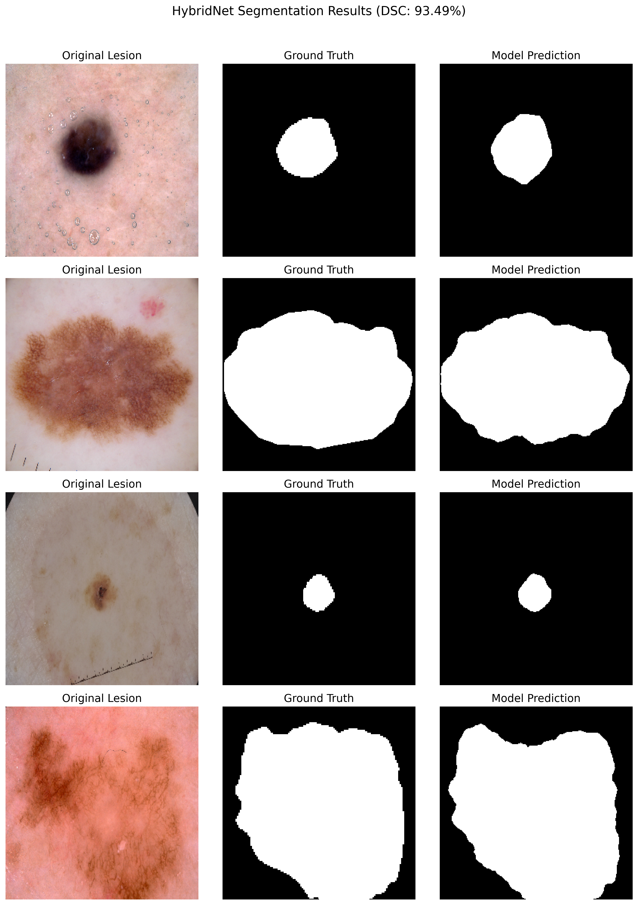
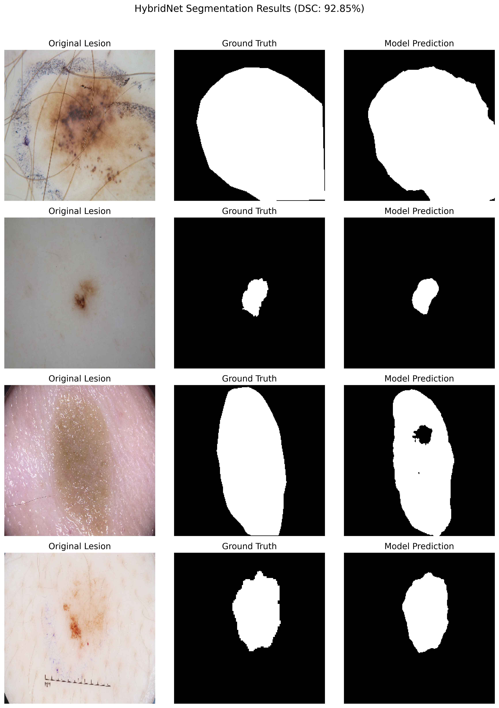

# HybridNet: Edge-Guided Dual Attention Network for Skin Lesion Segmentation

This repository contains the official PyTorch implementation and training notebooks for **HybridNet**, a high-capacity deep learning architecture engineered for precise skin lesion segmentation. 

This project was developed to prioritize absolute clinical accuracy over extreme parameter compression, addressing the boundary delineation flaws found in current ultra-lightweight point-of-care models.

## 🧠 Architecture Overview
HybridNet is built on a heavily modified U-Net skeleton, utilizing:
* **Transfer Learning Backbone:** Pre-trained `EfficientNet-B4` encoder for robust global semantic extraction.
* **Dual Attention Skip Gates:** Sequential Channel and Spatial attention mechanisms to filter out cutaneous noise (hair, lighting variations).
* **Edge-Guided Module (EGM):** Explicit structural priors generated via Canny edge detection, forcing the intermediate decoder layers to learn high-frequency boundary representations.
* **Multi-Task Hybrid Loss:** Optimizes for extreme class imbalances by combining Dice Loss, Focal Tversky Loss, and auxiliary Binary Cross-Entropy edge loss.

## 📊 Quantitative Results
The model was trained and evaluated independently on the ISIC 2017 and ISIC 2018 benchmarks using an 80/20 train/validation split. It significantly outperforms lightweight baselines (such as UltraLBM-UNet).

| Dataset | Model Parameters | Intersection over Union (IoU) | Dice Similarity Coefficient (DSC) |
| :--- | :--- | :--- | :--- |
| **ISIC 2018** | ~19.3M | **88.32%** | **93.49%** |
| **ISIC 2017** | ~19.3M | **88.20%** | **92.85%** |

## 🖼️ Qualitative Proof
The integration of the EGM and Dual Attention allows HybridNet to successfully navigate complex artifacts like hair occlusion and low-contrast borders.

### ISIC 2018 Segmentation

### ISIC 2017 Segmentation

## 💻 Repository Structure
* `HybridNet_ISIC2018.ipynb`: Complete data loading, architecture definition, and training loop for the ISIC 2018 dataset.
* `HybridNet_ISIC2017.ipynb`: Adapted pipeline for the pre-split ISIC 2017 dataset.

## 🚀 How to Use
These notebooks are optimized for execution on **Kaggle** or **Google Colab** using dual T4 GPUs.
1. Clone this repository.
2. Upload the desired `.ipynb` file to your Kaggle/Colab environment.
3. Mount the respective ISIC dataset.
4. Run all cells to initialize the `HybridNetAligned` architecture and begin the 75-epoch training loop. 

---
*Developed by Sama Ruthwik Reddy.*
